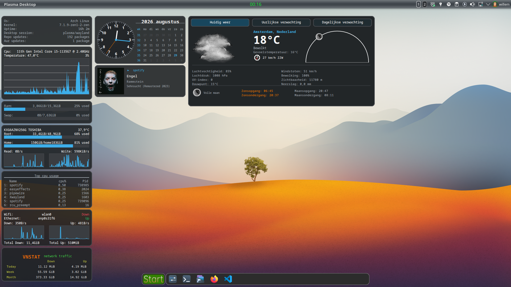

# Conky NextGen

A modular, theme-driven Conky UI framework with a Lua/Cairo rendering engine, Bash data backend, and a full visual Designer.
Built for modern desktops (KDE Plasma Wayland/X11), with clean SIGUSR1 reloads and zero window flashing.



---

## Install

```bash
# Clone into ~/.conky
git clone git@github.com:molnari811023/conky-nextgen.git ~/.conky

# Desktop entry (optional — adds NextGen Designer to app menu)
cp ~/.conky/nextgen-designer.desktop ~/.local/share/applications/

# Fetch weather/system data
bash ~/.conky/sh/0_fetch_all.sh

# Launch the Designer
python3 ~/.conky/sh/designer/main.py

# Or run a widget directly
conky -c ~/.conky/clock_cal.conf
```

The Designer auto-saves and triggers SIGUSR1 reloads — Conky updates instantly without restarting.

---


*The NextGen Designer — live preview, property editor, theme controls*

### Widgets

| Clock + Calendar | Clock + Calendar (calendar) | System Info |
|:---:|:---:|:---:|
|  |  |  |

| CPU | CPU — View 1 | Memory + Swap |
|:---:|:---:|:---:|
|  |  |  |

| Disk | NVIDIA GPU | Top (Multi-View) | Top — View 1 |
|:---:|:---:|:---:|:---:|
|  |  |  |  |

### Weather (Multi-View + Interactive)

The weather widget supports 3 views with clickable labels — click any label to switch views:

| Current Weather | Hourly Forecast | Daily Forecast |
|:---:|:---:|:---:|
|  |  |  |

**Features:**
- **Current** — temperature, feels-like, wind, UV index, sunrise/sunset, moon phase, AQI
- **Hourly** — 4-hour forecast with precipitation, wind, temperature
- **Daily** — 4-day forecast with high/low, precipitation probability, UV
- **Interactive** — mouse click switches between views
- **22 languages** — full i18n: Hungarian, English, German, French, Spanish, and 17 more

---

## What NextGen Provides

- **Desktop widgets** — clocks, calendars, bars, rings, graphs, images, SVG
- **Multi-view layouts** — switch between views with a single click (see `top` widget)
- **System info** — CPU, RAM, NVMe, sensors, network, battery, DMI
- **Advanced weather** — current, hourly, daily, AQI, MeteoAlerts, sun/moon
- **Themes** — palette → gradients → per-widget defaults; every color resolves automatically
- **Views & groups** — switchable layouts, clickable regions, mouse-driven navigation
- **Visual editing** — no Lua coding required; everything is editable in the Designer
- **22 languages** — full weather i18n with `.po`/`.mo` translation files
- **X11 + Wayland** — runs on both; SIGUSR1 reload patch eliminates window flashing on X11

## Multi-View

Widgets can define multiple views and switch between them with a mouse click. The `top` widget demonstrates this:

- **Main view** — top CPU processes
- **View 1** — top memory processes

Click anywhere on the widget to toggle views. Configure in the Designer with the **Views** tab, or in `widget.lua`:

```lua
-- Views
_VIEWS = {
    { name = "main" },
    { name = "view_1" },
}

-- Mouse click toggles between views
MOUSE_CLICK_LEFT = function() view_toggle("view_1") end

-- Items belong to a view
draw[#draw + 1] = { type = "text", view = "main", ... }
draw[#draw + 1] = { type = "text", view = "view_1", ... }
```

## Designer (GTK3)

A Python/GTK3 application that edits `widget.lua` and `widget.conf`:

- **Live preview** — renders inside a real Conky window; what you see is what you get
- **Property editor** — tabs for widgets, themes, colors, and Conky configuration
- **Auto-save** — writes files and triggers SIGUSR1 reload; Conky updates in place
- **Log console** — tails the Conky log for real-time debugging
- **Theme editor** — adjust palette, gradients, and defaults with instant visual feedback

### Designer Architecture

```
sh/designer/
├── main.py                 # GTK application entry point
├── engine/
│   ├── lua_parser.py       # Parse widget.lua structure
│   ├── lua_data.py         # Read/write widget properties
│   ├── theme_engine.py     # Theme resolution (palette → gradients → defaults)
│   ├── theme_writer.py     # Write theme block back to widget.lua
│   ├── gradient_gen.py     # Auto-generate gradients from palette colors
│   ├── activity_log.py     # Action history for undo
│   └── widget_schema.py    # Widget type definitions & validation
├── ui/                     # GTK window, tabs, property widgets
├── tests/                  # Unit tests
└── icons/                  # App icons (SVG + PNG)
```

## Lua Framework

All rendering logic lives in `lua/`.
A single `widget.lua` file defines:

- the `THEMES` block (palette, gradients, defaults)
- the `draw` list (widget order and properties)

### Load Order

```
widget.lua → require.lua → lua/core/* → lua/draw/* → lua/hardware/* → lua/weather/*
```

### Core Modules

| Module | Purpose |
|---|---|
| `draw_core.lua` | Main render loop, auto-interpretation, visibility control |
| `draw_group.lua` | Group offsets, view filtering, layout stacking |
| `mouse.lua` | Mouse event dispatching, hit-testing, click regions |
| `theme_engine.lua` | Runtime palette/gradient/default resolution |
| `translate.lua` | `.mo` translation loader for weather data (22 languages) |
| `utils.lua` | Safe math, hex colors, gradient interpolation, Conky variable parsing |
| `capture.lua` | Shell command execution with result caching |

### Draw Modules

| Module | Renders |
|---|---|
| `background.lua` | Rounded rectangles with gradient fills and borders |
| `bar.lua` | Progress bars — smooth, block, dot, and polygon modes |
| `calendar.lua` | Month calendar grid with day highlighting |
| `clock.lua` | Analog clock with hour/minute/second hands |
| `graph.lua` | Scrolling time-series graphs with configurable scales |
| `rings.lua` | Circular gauges with alarm thresholds |
| `svg.lua` | SVG rasterization via librsvg |
| `image.lua` | PNG display with crop, tint, and rotate |
| `text.lua` | Text with alignment, line wrapping, and hyphenation |
| `lines.lua` | Lines — solid, dash, dot patterns |
| `hyphen.lua` | LibreOffice `.dic` hyphenation for language-aware text wrapping |
| `icon_theme.lua` | XDG icon resolver for system tray-style icons |

### Hardware Modules

| Module | Data Source |
|---|---|
| `battery.lua` | Battery level, headset/mouse battery via UPower |
| `core.lua` | DMI info, shell cache, system identity |
| `dmi.lua` | BIOS, board, chassis details from `/sys/class/dmi/id/` |
| `info.lua` | CPU model, NVMe SMART data, install date |
| `sensors.lua` | CPU/NVMe/WiFi temperature, fan speeds via lm-sensors |
| `network.lua` | WiFi SSID/signal, public IP, ping latency |
| `usb.lua` | USB device mount detection |
| `mtp.lua` | MTP device detection (KDE Plasma) |

### Weather Modules

| Module | Data |
|---|---|
| `current.lua` | Current conditions — 35 accessors for every field |
| `hourly.lua` | Hourly forecast (1–24 hours) |
| `daily.lua` | Daily forecast (1–7 days) |
| `air.lua` | Air quality — PM2.5/10, gases, pollen, AQI index |
| `alerts.lua` | MeteoAlarm XML parser — 26 functions for warning data |
 | `sunmoon.lua` | Sunrise/sunset, moon phase, golden hour |
 | `units.lua` | Unit labels, city names, locale-aware formatting |
| `core.lua` | Data loader, WMO weather codes, icon mapping |

## Widget Structure

Each widget consists of three files:

| File | Purpose |
|---|---|
| `widget.conf` | Conky configuration (Designer-generated) |
| `widget.lua` | Theme block + draw list (Designer-edited) |
| `widget.png` | Preview icon (for Conky Manager) |

Included widgets: `clock_cal` (analog clock + calendar), `cpu` (multi-view CPU stats), `disk` (NVMe/disk health), `weather` (multi-view with current/hourly/daily), `top` (multi-view system stats), `info` (system dashboard), `mem_swap` (memory + swap), `nvidia` (GPU stats).

## SIGUSR1 Reload Patch (X11)

NextGen includes a patch for clean X11 reloads (`pkg/sigusr1-reload.patch`):

- **Keeps the X window alive** — no destroy/recreate cycle
- **Preserves the X11 display connection** — no reconnect overhead
- **Queries real window attributes** via `XGetWindowAttributes()` — correct visual, colormap, and geometry
- **No flash, no content loss** — widget content stays visible through the reload
- **Wayland unaffected** — already reloads cleanly by default

The patch is applied automatically when building via the included `PKGBUILD`.

## Shell Backend (`sh/`)

Bash scripts fetch all external data into `tmp/`:

| Script | Data |
|---|---|
| `all_in_one.sh` | Single-call fetcher (weather + hardware + network) |
| `0_fetch_all.sh` | Full data fetch (all modules) |
| `4_fetch_weather.sh` | Open-Meteo weather API |
 | `11_fetch_alerts.sh` | MeteoAlarm XML feeds |
 | `13_fetch_maps.sh` | Weather map tiles |
| `fetch_network.sh` | Public IP, ping latency tests |
| `fetch_nowplaying.sh` | MPRIS player data via playerctl |
| `updates.sh` | Arch Linux package update checks |

Data is cached as JSON in `tmp/` and read directly by the Lua modules — no database required.

## Themes

Themes are defined in the `THEMES` block of `widget.lua`:

```lua
THEMES = {
  theme = {
    palette   = { bg_dark="#202326", fg="#fcfcfc", accent="#3daee9", ... },
    gradients = { bar_cpu = { {1,"#3daee9",1} }, ... },
    defaults  = { bar={fg="bar_cpu",bg="bg"}, ring={radius=35}, ... },
  },
}
```

- **Palette** — named colors; the building blocks for everything else
- **Gradients** — named color ramps; color fields reference them by name (e.g. `fg = "bar_cpu"`)
- **Defaults** — per-widget-type fallback values; a bare `type = "bar"` still looks right

Themes can be switched at runtime from the Designer's Theme tab. Widgets can override per-item with `theme = "other_theme"`.

## Requirements

- **Conky 1.24.3+** (Lua 5.5, Cairo, Xft, Imlib2, RSVG)
- **Python 3.10+** with PyGObject (GTK3) — for the Designer
- **Bash** + curl + jq — for data fetchers
- **Lua modules**: dkjson, lfs, lua-utf8 (optional: lpeg for faster JSON decoding)
- **System tools**: lm-sensors, playerctl, upower, lsblk
- **Optional**: XDG icon themes, `kio-extras` (MTP support under KDE Plasma)

## Documentation Status

This project has been under active development for the past 8 months. During
this time many modules have been rewritten from scratch — some of them more
than 50 times — and the internal architecture has evolved significantly.

Because of this rapid development, the current documentation is outdated and
no longer reflects the actual state of the NextGen system. The codebase is
stable and up to date, but the manual still describes older versions of the
designer, the modules, and several features that have since been removed or
replaced.

A complete rewrite of the documentation is in progress.

---

## Documentation

- [NextGen.md](NextGen.md) — full reference (themes, configuration, troubleshooting, shell backend, Lua engine internals)
